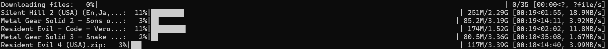

# MyrientDL

## Description
**MyrientDL** is a command-line tool designed to automate the process of searching for and downloading game files from [Myrient](https://myrient.erista.me/). The tool uses fuzzy matching to search for specific game titles provided in a text file, extracts the best-matching download links from Myrient, and allows for concurrent downloads of the selected files. This is especially useful for users looking to streamline their game archiving process from Myrient’s vast collection.

### Features:
- **Automated Link Extraction**: Search Myrient for game titles and extract download links.
- **Fuzzy Matching**: Finds links even when the title in the URL is not an exact match.
- **Batch Processing**: Download multiple game files concurrently.
- **Error Handling**: Retry failed downloads and log errors.
- **Customizable**: Set the number of concurrent downloads, output directory, and match precision.

### Alternatives:
While other download managers like `wget` or `aria2` exist, MyrientDL is purpose-built for Myrient, offering an all-in-one solution to search, retrieve, and download game files in one go.

---

## Visuals
Here’s an example of how the tool looks when running:

  
The tool displays a progress bar for each file being downloaded, along with real-time download speeds.

---

## Installation

### Requirements:
- **Python 3.8+**
- **pip** (for installing dependencies)

### Steps:
1. Clone the repository:
   ```bash
   git clone https://github.com/Darkkid819/MyrientDL.git
   cd MyrientDL
   ```
2. Set up a virtual environment (optional but recommended):
   ```bash
   python -m venv venv
   source venv/bin/activate  # On Windows, use venv\Scripts\activate
   ```
3. Install dependencies:
   ```bash
   pip install -r requirements.txt
   ```

---

## Usage

### Basic Command:
To search and download game files:
```bash
python myrientdl.py -u https://myrient.erista.me/.../ -kw games.txt -d -l links.txt -c 5 -p ~/Downloads
```

### Arguments:
- `-u` / `--url`: Base URL to search.
- `-kw` / `--keywords`: Text file with game titles (one per line).
- `-o` / `--output`: Output file to store links.
- `-d` / `--download`: Flag to enable downloading.
- `-l` / `--linkfile`: File containing previously extracted links.
- `-c` / `--concurrent`: Number of concurrent downloads (default: 5).
- `-p` / `--path`: Directory to save downloads (default: current directory).
- `--topn`: Number of top matches to retrieve for each keyword.

---

## Support
For help and troubleshooting, please open an issue on the [GitHub repository](https://github.com/Darkkid819/MyrientDL/issues).

---

## Contributing
We welcome contributions! Follow these steps to get started:
1. Fork the repository.
2. Create a new branch:
   ```bash
   git checkout -b feature/your-feature-name
   ```
3. Make your changes.
4. Submit a pull request.

---

## Authors and Acknowledgment
- **[Jordan Mitacek](https://github.com/Darkkid819)** - Creator and maintainer.

Thanks to the [Myrient](https://myrient.erista.me/) project for providing a rich game archive.

---

## License
This project is licensed under the GNU General Public License v3.0. See the [LICENSE](LICENSE) file for details.